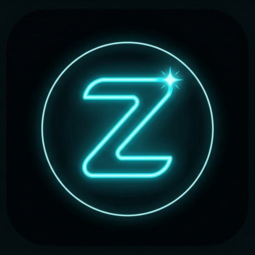

<div align="center">



# zoeX

**Zoe Xavier — a companion who's always there.**

Black & cyan glow · live streaming replies · built with Groq

`Node 18+` · `Express` · `Groq` · `Zero build step`

</div>

---

## What is zoeX?

A real-time AI companion web app. Streaming chat, conversation memory,
a custom brand identity, and a persona that lives in one file.

## Features

- ⚡ Live streaming replies (token by token, Server-Sent Events)
- 🧠 Conversation memory across visits (last 60 exchanges, stored locally)
- 🎨 Real generated logo + full brand identity
- 🔁 Automatic model fallback — if one model is unavailable it tries the next
- 📱 Fully responsive, safe-area aware
- 🔒 API key never touches the browser

## Quick start

```bash
# 1. get a free Groq key → https://console.groq.com/keys
# 2. add it
cp .env.example .env   # then paste your key into .env
# 3. run
npm install
npm start
```

Open **http://localhost:3000**.

### Configuration

| Variable | Default | Purpose |
|---|---|---|
| `GROQ_API_KEY` | — | **Required** (in `.env` or environment) |
| `GROQ_MODEL` | `openai/gpt-oss-120b` | Any Groq-supported model |
| `PORT` | `3000` | Server port |

## Deploy (Render)

Push, then create a **Blueprint** from this repo on Render — `render.yaml`
is included. Add `GROQ_API_KEY` in the environment settings. Health check:
`/health`.

## Project structure

```
zeox-ai/
├── index.html        → the page
├── style.css         → design system: glass, glow, motion
├── script.js         → streaming client, memory, composer
├── persona.js        → Zoe's soul — backstory + rules
├── server.js         → Express + Groq streaming proxy (model fallback)
├── public/
│   ├── logo.png      → generated brand mark
│   ├── logo.svg      → vector icon
│   └── favicon.svg   → browser tab icon
├── render.yaml       → one-click Render deploy
└── package.json
```

## Customizing Zoe

Her voice, story and rules live in **`persona.js`**. Edit that one file and
the whole product changes with her.

---

<div align="center">

**zoeX** · built with care · powered by [Groq](https://groq.com)

</div>
